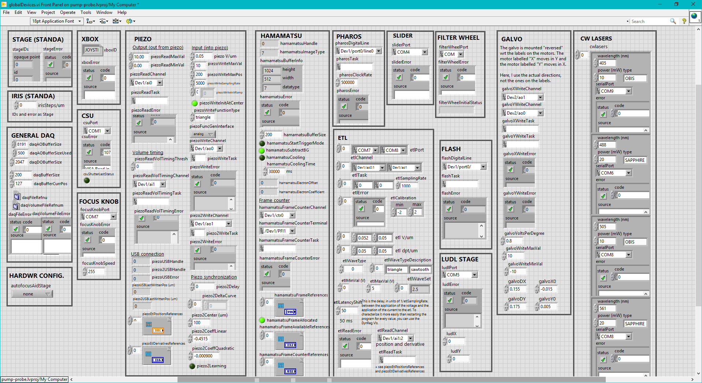
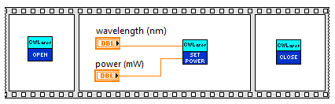
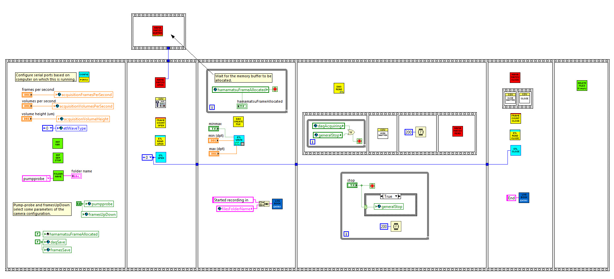
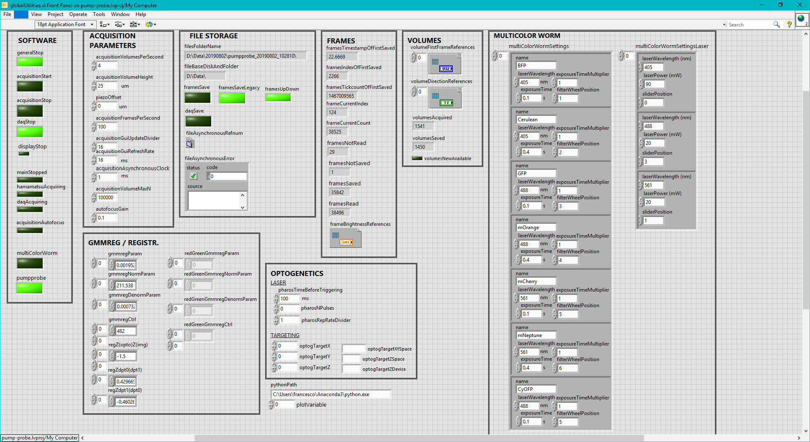

LabView Francesco's LabView code

Summary: LabView software engineers love having wires all over the place. I don't.

The main goal of this library is to provide various subVi that allow someone to "write" software for the lab in a quick way and, in doing this, I adopted every possible way to hide wires wherever it was possible.

The main file of the library is the LabView project pumpprobe.lvproj. Any other program inside the library has to be started from the project, and not loaded separately. The project contains several folders, out of which the top level ones are
* basic
* main
* subvi
* variables

The folder basic/ contains simple programs that allow you, e.g., to control single devices or do simple tasks, in addition to test programs. main/ contains the main programs used for the different type of experiments, i.e. the ones you would start to make the actual measurements. subvi/ is by far the most populated folder and contains all the subVIs out of which all the other programs in basic and main are assembled. These include subVIs for the control of the devices, loading and saving files, fitting data, computer vision tools, geometric transformations, visualization tools, and so on. The last folder, variables/, contains the special variables that allow data to be shared between subVIs. In addition to the LabView VIs, the repository also contains a dll (and corresponding VisualStudio project) called wormUtilities, which uses C/C++ code from other repositories (right now gmmreg-lw and wormneuronsegmentation). The advantages of using this C/C++ code to do geometric transformations and segmenting neurons are two: the implementations are very fast and efficient, and you can use the exact same code both in LabView and in the analysis in Python. To work with this dll, the OpenCV and vxl libraries should be in the correct paths. Regarding the names of the programs, throughout the project I've tried to stick to a self-explanatory naming convention, even though, in some cases, this has made the file and variable names a bit long. 

In LabView, the canonical way to move data around between functions and share it between different parts of the program is to draw wires that connect operators and subVIs. Using these wires is pretty straightforward in simple programs, but becomes a literal spaghetti mess as soon as the program becomes a bit more complicated. In addition (maybe even worse), the wires often stand on your way when you want to structure your program and split it semantically in different parts/subVI. For example, if you want to make exclusive use of wires to share data between two parts of the program that run continuously in while loops, the only way you can do it is to merge the while loops into one. 

There are quite a bit of ways that NI engineers have come up with to avoid using wires for every single variable passing, or to be able to share data between subVIs without having to have everything within a single, gigantic while loop. Some of them actually make the code quite readable, but their implementation inside the framework of LabView makes them very inefficient (more details below). These are global and shared variables, and I've used them in parts of the code that are not time-critical and that exchange very small variables like, e.g., managing devices over a serial connection. The main reason why their implementation is so inefficient for big variables is that each time they are read, a copy of the data is created, and you cannot write to single elements of arrays stored in global variables without copying and then overwriting the whole array. Another way to share data between subVIs are references, introduced rather recently in LabView. These are, in practice, just like C references (more detail below). Using references is necessary to share data with time-critical parts of the code that deal with big variables, like the acquisition of data from the DAQ card and, most importantly, from the camera. Both types of data sharing have shaped the structure of the programs in this library.

As said, one case in which global variables are used is the one of simple devices managed via serial connection, that deal with only a handful of bytes and only once in a while. This allows the subVIs dedicated to these tasks to be very readable. For almost every device involved, there are three types of subVIs inside subvi/subvi-devices/: deviceOpen.vi, deviceTask.vi, and deviceClose.vi, where "device" is the name of the device you are dealing with (e.g. a stage, or the cwlasers, or the filterWheel) and "Task" is the task you wish to perform with the device (Read, Write, Move, ...). Device information like its COM port (VISA Resource name in LabView terminology) or alternative identifiers, and its error status are exchanged between these subVIs using global variables stored in the vi variables/globalDevices.vi and named, e.g., devicePort and deviceError. If you open variables/globalDevices.vi, you will see some sort of global control panel that allows you to see the status of all the devices at once, as you can see below.

The typical structure of a single-device program that opens, writes to, and closes one of these devices will look like the following. The example sets the laser power in one of the continuous-wave lasers.

The same type of structure is approximately replicated for devices that are controlled by analog or digital signals via the DAQ card. However, while the control of devices over serial port in a program like the one above remains the same if the program is more complex and uses several devices, controlling devices via the DAQ card comes with some caveats, because if different channels have to use the same resources on the card, like two analog channels using the same dedicated clock, they have to be initialized together (in the same DAQmx task).

The programs that you need to do the actual recordings (e.g. whole brain imager or multicolor recordings) are in the folder main/. Inside this folder there are two types of programs. To the first class belong programs that don't have time-critical parts and for which the user interface and the actual tasks are in the same VI. For example, the one for multicolor recordings falls in this category. To the second class belong, instead, programs that do have time-critical parts, most notably the acquisition of images from the camera at very high frame rates (100-200 fps). For them, the user interface and the underlying software that controls and reads from the devices need to be separate. This is necessary because of how LabView manages the execution of the VIs, i.e. with different execution subsystems: the front panel (the GUI side of the VIs) can be updated (togehter with the redrawing of graphs) only in the user interface subsystem, while most of the actual tasks need to run in higher priority subsystems, like data acquisition. When a VI that is executing in a subsystem needs to update its front panel, LabView has to move it to the user interface subsystem and the relevant data to a shared part of the RAM. While the front panel redraws, the VI is "trapped" and can, e.g., miss several frames coming from the camera. To avoid this, the user interface and the backend operations of the program can be split in two VIs, with the former being main/mainUI followed by the type of measurement, and the latter being in the main/backend/ folder and lacking any updated to its front panel during the main execution. This solution helps a lot in reducing the number of missed data from the high-speed devices (frames dropped), even though you will still have occurrences if the user interface is updated too much. Indeed, you can drop frames from the camera even with a single click on the title bar of one of the VIs windows, so my suggestion is to arrange the windows before starting the measurement so that you can see everything at once, and not even touch the mouse while the program runs, until you need to stop the program.

As an example, let's have a look at the software used for the pump-probe experiments: main/backend/mainRecord.vi and main/mainUIDisplay.vi. The programs for the whole brain imager work in a similar way. The screenshot below shows the block diagram of mainRecord. 

As you can see, there is one main sequence structure. The first three and the last two frames are dedicated to initialization of variables, configuration, opening, and closing of devices, and file management. The fourth frame contains, instead, the main part of the program. In addition, in the upper part of the diagram there is a lone, single-frame sequence structure that starts after the second frame of the main sequence and keeps running until the end of the execution. In the first frame, parameters of the measurement (like the frame rate) are saved in global variables, and other global variables are intialized to their default/initial values, including the name of the folder in which to save data, that is generated based on the date and current time. Not all the global variables are stored in variables/globalDevices.vi. The ones that are not directly related to the control and status of the devices are stored in variables/globalUtilites.vi, that works like a global control panel showing the status and the settings of the current measurement, like the frame rate in the global variable called acquisitionFramesPerSecond (see below). Among these variables, there are also boolean variables that control the flow of the execution of the program and coordinate the execution of different subVIs. I'll come back to them in a moment.

In the second frame, the devices are initialized (the connection to them is "opened", from where the subVIs' names). All the subVIs are color coded. For example, all the subVIs dealing with the Hamamatsu camera are red and have the word Hamamatsu on their icon. Some subVIs have mixed color codings, like frameCounterOpen, which is yellow with a red bar. This is because it deals with part of the acquisition of data from the Hamamatsu camera, but it uses the DAQ card (yellow color coding). The same happens for the electrically tunable lens (etl) subVIs. Note that, at some point, the choices of single colors finished and I started using colored bars in the icons. The only double-color icons that have actual mixed color coding are the yellow ones involving the DAQ.

After the second frame, both the third frame and the lone frame on top start. The lone frame could, in principle, start executing right from the beginning, but is forced to wait for all the inputs (even if they are not used), so it starts only when the second frame provides the variable that is brought over by the wire. The only subVI in the lone frame is subvi/subvi-devices/hamamatsuBufferComplete.vi. It allocates arrays that are used to store the frames downloaded from the camera (in a circular-buffer mode) and data coming from the DAQ card, and keeps them alive until the program is stopped. In addition, it creates references to these arrrays and copies the references to global variables. These global variables are crucial in the sharing of big amount of data between different subVIs. Each subVI has a copy (or gets passed a copy) of the references (the references need to be copied once, because they don't change throughout the execution) and can therefore directly access the location in the RAM where the data is stored without having to create a copy of the data as with global variables. To overcome a quirk in the implementation of references in LabView, if an array has to be accessed element-wise, each element has its own reference, stored in a global variable that is an array of references. After the allocation of the arrays is complete, hamamatsuBufferComplete sets the global variable hamamatsuFrameAllocated to true. This variable is read in the while loop in the third frame of the main sequence, which at this point stops so that the execution can proceed to the fourth frame.

The fourth frame contains the main part of the program, divided in three main blocks. The subVI daqReadEtl contains a while loop in which it reads the data from the DAQ inputs and stores it to the allocated buffers via the references described above. Once it starts reading the data, it sets the global variable daqAcquiring to true, which stops the while loop in the small sequence structure contained in the current frame of the main VI. This small sequence then opens the shutter of the spinning-disk unit and starts hamamatsuRead. Also this subVI contains a while loop, and it reads the frames from the camera and stores them in the allocated arrays via the references. These while loops, as well as one in hamamatsuBufferComplete, are controlled by a boolean global variable globalStop, that is controlled by the other while loop in the current frame of the sequence. When the "stop" control on the front panel is clicked, globalStop (stored in globalUtilities.vi) is set to true. All the subVIs that run while loops listen to this variable and, at this point, they stop. Note that the execution of these programs should never be stopped (except when they crash) with the red "Terminate" circular button that LabView provides. This would abort the execution completely, without properly closing and freeing the resources of the devices. If this happens, LabView has to be restarted (and sometimes also the devices themselves). In the same way, the while loops in daqRead and hamamatsuRead listen to the global variables daqSave and framesSave, respectively, that tell them when to save the data to file, in addition to storing it in RAM. After a generalStop is issued, everything in the current frame will stop within a few seconds.

In the fifth frame, the connections to the devices are closed and the relevant resources freed. Note that among the subVIs called there are also subVIs that write entries in the file logbook.txt inside the folder of the current day.

The user interface for main/backend/mainRecord.vi is main/mainUIDisplay.vi. It should be started only after the memory buffers for the data have been allocated (there is an indicator on the front panel of mainRecord that shows this). When started, it will make its own copy of the references so that it can access the frames and the rest of the data to display it. The rate at which the plots are refreshed should always stay relatively low, especially while you are saving the data. Briefly, the data in the arrays allocated by hamamatsuBufferComplete.vi can be accessed via the subVIs acquisitionGetVolume (for the volumetric images acquired) and piezoEtlGetPosFromFirstCount (for the z-positions corresponding to the frames in the volumes). These VIs are optimized to extract data from the buffers without conflicting with restriction on concurrent use of the references, and also cache the last extracted set of data. In this way, if two parts of the program request the last acquired volume almost at the same time, the data is extracted from the buffer only once.

